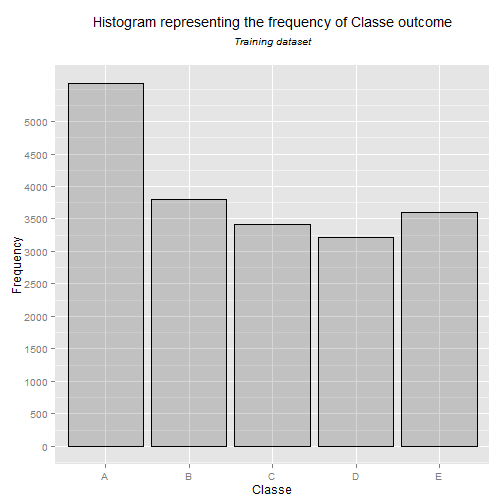
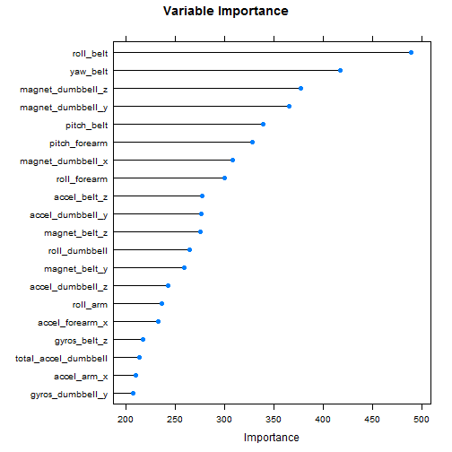

## Using Machine Learning to Recognize the Quality of Performing Weight Lifting Exercise


by: Mohammed K. Barakat

August 18, 2015

## Executive Summary

This Human Activity Recognition analysis is focused on recognizing the quality of performing weight lifting exercises. The approach used aims at investigating "how (well)" an activity is performed by the participant.

Six young participants were asked to perform one set of 10 repetitions of the Unilateral Dumbbell Biceps Curl in five different fashions: according to specification (Class A), throwing the elbows to the front (Class B), lifting the dumbbell only halfway (Class C), lowering the dumbbell only halfway (Class D), and throwing the hips to the front (Class E). Class A corresponds to the specified (ideal) execution of the exercise, while the other 4 classes correspond to common mistakes.

Using the **classe** variable as outcome, and some other variables in the **training** dataset as predictors the goal of this Machine Learning analysis is to predict the manner in which the participants did the exercise.

More information about the research is available [here](http://groupware.les.inf.puc-rio.br/har) (see the section on the Weight Lifting Exercise Dataset).

## Input data

The analysis uses csv-formatted datasets available through the links [pml-training](https://d396qusza40orc.cloudfront.net/predmachlearn/pml-training.csv) and [pml-testing](https://d396qusza40orc.cloudfront.net/predmachlearn/pml-testing.csv). Both sets come from this [source](http://groupware.les.inf.puc-rio.br/har).

The *pml-training* dataset consists of 19,622 records which will be divided into two sets: a *training* dataset that will be used to train the model for prediction, and a *testing* dataset to be used to validate the prediction model and decide on model accuracy. The *pml-testing* dataset consists of 20 new records to be used to submit prediction assignment associated with the Practical Machine Learning course project.  

### Download datasets


```r
trainURL<-"https://d396qusza40orc.cloudfront.net/predmachlearn/pml-training.csv"
testURL<-"https://d396qusza40orc.cloudfront.net/predmachlearn/pml-testing.csv"

trainFile<- "./pml-training.csv"
testFile<-"./pml-testing.csv"

if (file.exists(trainFile) == FALSE) {
  download.file(trainURL, destfile = trainFile)
}

if (file.exists(testFile) == FALSE) {
  download.file(testURL, destfile = testFile)
}
```

### Data processing

In order to perform the best model training analysis the datasets need to be pre-processed for any missing values. Hence, datasets are read while considering values of "NA", "#DIV/0!", and blanks as NA/missing values recognized by R during analysis.


```r
pmlTrain <- read.csv(file = 'pml-training.csv',na.strings = c('NA','#DIV/0!',''))
pmlTest <- read.csv(file = 'pml-testing.csv',na.strings = c('NA','#DIV/0!',''))
```

## Exploratory data analysis

### Exploring the outcome variable

A histogram is built on the pml-training dataset using the **classe** variable to have some clues on the frequency of this variable values across the dataset.


```r
library(ggplot2)
g<-ggplot(pmlTrain,aes(x=classe))+
        geom_histogram(alpha = .20, binwidth=.5, colour = "black")+
        labs(x="Classe",y="Frequency")+
        scale_y_continuous(breaks=seq(0, 5000, 500))+
        theme(plot.title = element_text(size = 14, face = "bold", colour = "black", vjust = +1))+        
        ggtitle(expression(atop("Histogram representing the frequency of Classe outcome",
                                atop(italic("Training dataset")))))
g
```

 

The histogram above shows that **classe** variable has five possible values; A, B, C, D, and E. Class-A which represents the ideal weight-lifting fashion has the highest number of observations (around 5,500), whereas others fashions have close number of observations (around 3,500).

## Features selection

### Feature Slicer

Using the **head(pmlTrain)** or **str(pmlTrain)** functions in R we can detect some variables that do not contribute to the outcome classification model. Such variables would even make modelling inaccurate. Hence, variables with **NA** values will be removed using a feature slicer index which is a character vector that acts as a filter for valid variables without NAs, and which will be deployed when needed in both the training and the testing datasets. Besides, the first 7 columns are recognized to be irrelevant that can also be removed from the datasets.


```r
featureSlice <- colnames(pmlTrain[colSums(is.na(pmlTrain)) == 0])
featureSlice <- featureSlice[-c(1:7)]
```

### Partitioning training and testing datasets

To train our prediction model then test its accuracy we need to split the **pml-Training** dataset into training and testing data (70/30 ratio) while applying the feature slicer filter.


```r
library(caret)
set.seed(3030)
inTrain<-createDataPartition(y=pmlTrain$classe,p=0.7,list = FALSE)
training<-pmlTrain[inTrain,featureSlice]
testing<-pmlTrain[-inTrain,featureSlice]

dim(training);dim(testing)
```

```
## [1] 13737    53
```

```
## [1] 5885   53
```


Both resulted datasets have **53** variables with **13737** observations for training and **5885** observations for testing.

### Checking variables variability

It is a good practice to make sure the training data does not include predictors with no variability. I.e. predictors that have one or very few unique values relative to the number of observations. This can be detected with the **nzv** value of the **NearZeroVar** function results. 


```r
nearZeroVar(training,saveMetrics = TRUE)
```

```
##                      freqRatio percentUnique zeroVar   nzv
## roll_belt             1.119427    7.98573196   FALSE FALSE
## pitch_belt            1.141791   12.21518527   FALSE FALSE
## yaw_belt              1.111437   13.15425493   FALSE FALSE
## total_accel_belt      1.074377    0.20382907   FALSE FALSE
## gyros_belt_x          1.079533    0.90267162   FALSE FALSE
## gyros_belt_y          1.168469    0.47317464   FALSE FALSE
## gyros_belt_z          1.051241    1.18657640   FALSE FALSE
## accel_belt_x          1.089552    1.15745796   FALSE FALSE
## accel_belt_y          1.103226    1.01186576   FALSE FALSE
## accel_belt_z          1.090461    2.09652763   FALSE FALSE
## magnet_belt_x         1.027778    2.20572177   FALSE FALSE
## magnet_belt_y         1.061269    2.10380724   FALSE FALSE
## magnet_belt_z         1.060423    3.13751183   FALSE FALSE
## roll_arm             50.893617   17.62393536   FALSE FALSE
## pitch_arm            77.193548   20.27371333   FALSE FALSE
## yaw_arm              33.690141   19.03617966   FALSE FALSE
## total_accel_arm       1.007911    0.47317464   FALSE FALSE
## gyros_arm_x           1.028090    4.59343379   FALSE FALSE
## gyros_arm_y           1.391076    2.69345563   FALSE FALSE
## gyros_arm_z           1.042216    1.72526753   FALSE FALSE
## accel_arm_x           1.051724    5.55434229   FALSE FALSE
## accel_arm_y           1.032895    3.81451554   FALSE FALSE
## accel_arm_z           1.043011    5.53978307   FALSE FALSE
## magnet_arm_x          1.000000    9.59452573   FALSE FALSE
## magnet_arm_y          1.031250    6.23862561   FALSE FALSE
## magnet_arm_z          1.062500    9.14318993   FALSE FALSE
## roll_dumbbell         1.076923   86.70015287   FALSE FALSE
## pitch_dumbbell        2.395604   84.38523695   FALSE FALSE
## yaw_dumbbell          1.010989   85.99403072   FALSE FALSE
## total_accel_dumbbell  1.087185    0.30574361   FALSE FALSE
## gyros_dumbbell_x      1.002262    1.70342870   FALSE FALSE
## gyros_dumbbell_y      1.231678    1.96549465   FALSE FALSE
## gyros_dumbbell_z      1.019139    1.41224430   FALSE FALSE
## accel_dumbbell_x      1.021097    2.99191963   FALSE FALSE
## accel_dumbbell_y      1.034884    3.31222246   FALSE FALSE
## accel_dumbbell_z      1.120690    2.93368275   FALSE FALSE
## magnet_dumbbell_x     1.081301    7.74550484   FALSE FALSE
## magnet_dumbbell_y     1.213115    6.03479653   FALSE FALSE
## magnet_dumbbell_z     1.094488    4.84822014   FALSE FALSE
## roll_forearm         11.269710   13.60559074   FALSE FALSE
## pitch_forearm        63.162791   19.16721264   FALSE FALSE
## yaw_forearm          15.970588   12.97954430   FALSE FALSE
## total_accel_forearm   1.161176    0.48773386   FALSE FALSE
## gyros_forearm_x       1.113208    2.04557036   FALSE FALSE
## gyros_forearm_y       1.018519    5.20492102   FALSE FALSE
## gyros_forearm_z       1.201893    2.13292568   FALSE FALSE
## accel_forearm_x       1.138462    5.65625682   FALSE FALSE
## accel_forearm_y       1.026667    7.09761957   FALSE FALSE
## accel_forearm_z       1.009259    4.04746306   FALSE FALSE
## magnet_forearm_x      1.072727   10.61367111   FALSE FALSE
## magnet_forearm_y      1.033333   13.22705103   FALSE FALSE
## magnet_forearm_z      1.023256   11.79296790   FALSE FALSE
## classe                1.469526    0.03639805   FALSE FALSE
```

As shown above all selected predictors have FALSE **nzv** value which indicates that all of them have reasonable variability in the dataset.

## Prediction Algorithms

Since the outcome (**classe**) is a categorical variable our algorithm should be based on one of those which are able to model categorical rather than regression models such as **glm, Tree, and Random Forest.** Yet, the **glm** requires further complicated preprocessing of the outcome variable as it is designed to model 2-value/binary values data whereas the **classe** variable have five different values.

Hence, we will start with deploying the **Classification Tree** algorithm and test its accuracy in predicting the outcome.

### Training using Classification Tree with cross validation

#### Training the model

In order to increase the accuracy of our algorithm we will train our model using the built-in option of cross validation in the Classification Tree. Cross validation is employed here with 5 resampling iterations. The code result below shows the outcome model of training using the classification tree algorithm.


```r
set.seed(1320)
modFit1<-train(classe~ .,data=training,method="rpart",trControl= trainControl(method = "cv",number = 5,allowParallel = TRUE))

modFit1$finalModel
```

```
## n= 13737 
## 
## node), split, n, loss, yval, (yprob)
##       * denotes terminal node
## 
##  1) root 13737 9831 A (0.28 0.19 0.17 0.16 0.18)  
##    2) roll_belt< 130.5 12582 8686 A (0.31 0.21 0.19 0.18 0.11)  
##      4) pitch_forearm< -33.15 1109   10 A (0.99 0.009 0 0 0) *
##      5) pitch_forearm>=-33.15 11473 8676 A (0.24 0.23 0.21 0.2 0.12)  
##       10) magnet_dumbbell_y< 436.5 9665 6925 A (0.28 0.18 0.24 0.19 0.11)  
##         20) roll_forearm< 123.5 6014 3553 A (0.41 0.18 0.18 0.17 0.06) *
##         21) roll_forearm>=123.5 3651 2429 C (0.076 0.18 0.33 0.23 0.18) *
##       11) magnet_dumbbell_y>=436.5 1808  899 B (0.032 0.5 0.041 0.23 0.19) *
##    3) roll_belt>=130.5 1155   10 E (0.0087 0 0 0 0.99) *
```

#### Evaluating the classification tree model and cross validation

After training the model we evaluate it using the testing dataset, which is another cross validation step, then compare its outcome to the testing data actual outcome using the **Confusion Matrix**.


```r
treePred<-predict(modFit1,testing)
treeCM<-confusionMatrix(treePred,testing$classe)
treeCM
```

```
## Confusion Matrix and Statistics
## 
##           Reference
## Prediction    A    B    C    D    E
##          A 1514  474  486  443  161
##          B   38  393   35  162  145
##          C  118  272  505  359  290
##          D    0    0    0    0    0
##          E    4    0    0    0  486
## 
## Overall Statistics
##                                           
##                Accuracy : 0.4924          
##                  95% CI : (0.4796, 0.5053)
##     No Information Rate : 0.2845          
##     P-Value [Acc > NIR] : < 2.2e-16       
##                                           
##                   Kappa : 0.3363          
##  Mcnemar's Test P-Value : NA              
## 
## Statistics by Class:
## 
##                      Class: A Class: B Class: C Class: D Class: E
## Sensitivity            0.9044  0.34504  0.49220   0.0000  0.44917
## Specificity            0.6286  0.91993  0.78617   1.0000  0.99917
## Pos Pred Value         0.4919  0.50841  0.32707      NaN  0.99184
## Neg Pred Value         0.9430  0.85407  0.87998   0.8362  0.88953
## Prevalence             0.2845  0.19354  0.17434   0.1638  0.18386
## Detection Rate         0.2573  0.06678  0.08581   0.0000  0.08258
## Detection Prevalence   0.5230  0.13135  0.26236   0.0000  0.08326
## Balanced Accuracy      0.7665  0.63249  0.63919   0.5000  0.72417
```


```r
modFit1Acc<-round(as.numeric(treeCM$overall[1]),4)
modFit1Err<-round(1-modFit1Acc,4)

modFit1Acc;modFit1Err
```

```
## [1] 0.4924
```

```
## [1] 0.5076
```

Unfortunately, the confusion matrix revealed a very low accuracy (**0.4924**). Knowing that the out-of-sample (Generalization) error equals (1-Accuracy) the out-of-sample error is estimated to be high with a value of **0.5076**. This implies that the classification tree is a weak prediction algorithm for this dataset and we need to look for another algorithm type.

### Training using Random Forest with cross validation

#### Training the model

Random Forest algorithm is known for its high accuracy in prediction where the algorithm grows multiple trees and vote for the best classifier. Hence, the next step is to train our model using Random Forest with cross validation of 5 resampling iterations.


```r
set.seed(1400)
modFit2<-train(classe~ .,data=training,method="rf",trControl= trainControl(method = "cv",number = 5,allowParallel = TRUE))
```

#### Variables Importance

It is worth seeing how predictors are ranked in terms of importance after training the model. This can be achieved with the below plot of the top 20 predictors.


```r
varsImp<-varImp(modFit2,scale = FALSE)
varsImp
```

```
## rf variable importance
## 
##   only 20 most important variables shown (out of 52)
## 
##                      Overall
## roll_belt              489.9
## yaw_belt               417.8
## magnet_dumbbell_z      377.4
## magnet_dumbbell_y      365.9
## pitch_belt             339.4
## pitch_forearm          328.0
## magnet_dumbbell_x      308.2
## roll_forearm           299.8
## accel_belt_z           277.4
## accel_dumbbell_y       276.6
## magnet_belt_z          275.7
## roll_dumbbell          264.4
## magnet_belt_y          258.8
## accel_dumbbell_z       242.4
## roll_arm               236.5
## accel_forearm_x        232.4
## gyros_belt_z           217.1
## total_accel_dumbbell   214.0
## accel_arm_x            209.8
## gyros_dumbbell_y       206.9
```

```r
plot(varsImp,top = 20,main="Variable Importance")
```

 

#### Evaluating the Random Forest model and cross validation

As we did with the previous algorithm, we apply cross validation by testing the Random Forest model on the testing dataset then compare its outcome to the actual outcome of the testing data using the **Confusion Matrix**.


```r
set.seed(1420)
rfPred<-predict(modFit2,testing)
rfCM<-confusionMatrix(rfPred,testing$classe)
rfCM
```

```
## Confusion Matrix and Statistics
## 
##           Reference
## Prediction    A    B    C    D    E
##          A 1673    9    0    0    0
##          B    0 1129    2    0    0
##          C    0    1 1021   26    0
##          D    0    0    3  938    2
##          E    1    0    0    0 1080
## 
## Overall Statistics
##                                         
##                Accuracy : 0.9925        
##                  95% CI : (0.99, 0.9946)
##     No Information Rate : 0.2845        
##     P-Value [Acc > NIR] : < 2.2e-16     
##                                         
##                   Kappa : 0.9905        
##  Mcnemar's Test P-Value : NA            
## 
## Statistics by Class:
## 
##                      Class: A Class: B Class: C Class: D Class: E
## Sensitivity            0.9994   0.9912   0.9951   0.9730   0.9982
## Specificity            0.9979   0.9996   0.9944   0.9990   0.9998
## Pos Pred Value         0.9946   0.9982   0.9742   0.9947   0.9991
## Neg Pred Value         0.9998   0.9979   0.9990   0.9947   0.9996
## Prevalence             0.2845   0.1935   0.1743   0.1638   0.1839
## Detection Rate         0.2843   0.1918   0.1735   0.1594   0.1835
## Detection Prevalence   0.2858   0.1922   0.1781   0.1602   0.1837
## Balanced Accuracy      0.9986   0.9954   0.9948   0.9860   0.9990
```


```r
modFit2Acc<-round(as.numeric(rfCM$overall[1]),4)
modFit2Err<-round(1-modFit2Acc,4)

modFit2Acc;modFit2Err
```

```
## [1] 0.9925
```

```
## [1] 0.0075
```

Here, the confusion matrix revealed a very high accuracy (**0.9925**). Knowing that the out-of-sample (Generalization) error equals (1-Accuracy) the out-of-sample error is estimated to be very low with a value of **0.0075**. This implies that the Random Forest is a strong prediction algorithm for this dataset and can be used to predict new datasets.

## Applying the selected model on a new dataset

The selected model will be used to predict the outcome of the *pml-testing* dataset that consists of 20 new observations. Yet, since columns of the new dataset must be identical to those used for training the model we need to rename the last column to *"classe"* then we apply prediction.


```r
lastColNumber<-length(colnames(pmlTest))
colnames(pmlTest)[lastColNumber]<-"classe"
```

Notice that we need to apply the same preprocessing we did on the training dataset to the new dataset. So, we pass the feature slicer index to the dataset during prediction as shown in the code below.


```r
predict(modFit2,newdata = pmlTest[,featureSlice])
```

```
##  [1] B A B A A E D B A A B C B A E E A B B B
## Levels: A B C D E
```

The selected model was able to predict the outcome value for each of the 20 observations in the *pml-testing* dataset.
